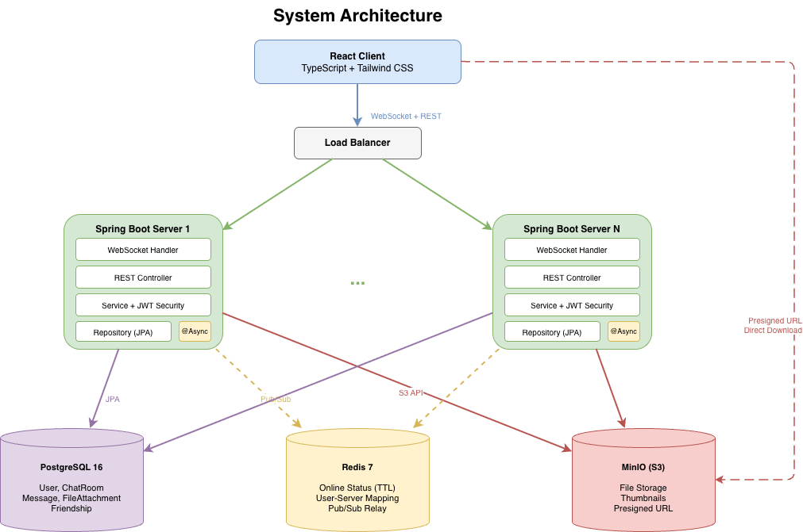
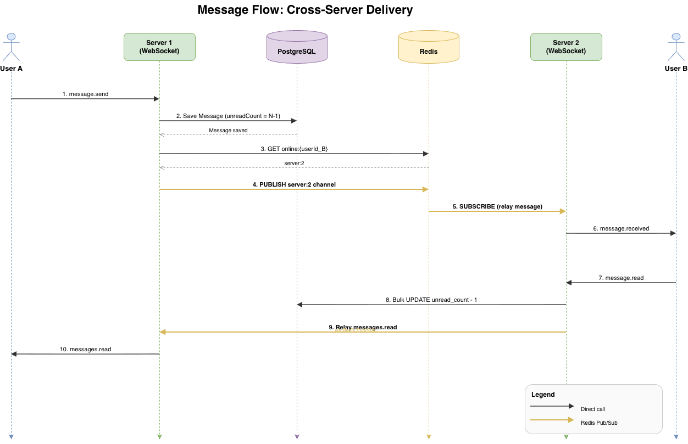
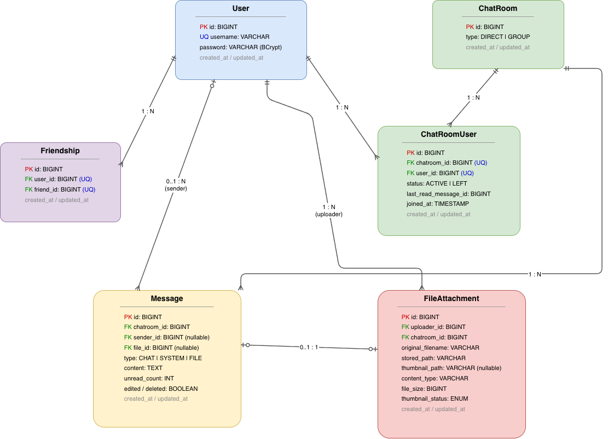

# Realtime Chat

Spring Boot + React 기반의 실시간 채팅 애플리케이션.
WebSocket을 통한 실시간 메시지 전송, Redis Pub/Sub 기반 다중 서버 확장, S3 파일 전송을 지원합니다.

## 주요 기능

- **1:1 / 그룹 채팅** - WebSocket 기반 실시간 텍스트 메시지
- **파일 전송** - 이미지, PDF, 문서 업로드 + 비동기 썸네일 생성
- **읽음 처리** - 메시지별 unreadCount 기반 읽음/안읽음 표시
- **온라인 상태** - Redis TTL 기반 온라인/오프라인 상태 추적
- **메시지 관리** - 수정 (edited 플래그), 삭제 (soft delete)
- **다중 서버 지원** - Redis Pub/Sub으로 서버 간 메시지 중계

## 기술 스택

| 구분 | 기술 |
|------|------|
| **Backend** | Java 17, Spring Boot 3, Spring WebSocket, Spring Security (JWT), Spring Data JPA |
| **Frontend** | React 19, TypeScript, Tailwind CSS, Vite |
| **Database** | PostgreSQL 16 |
| **Cache / Pub-Sub** | Redis 7 |
| **File Storage** | MinIO (S3 호환) |
| **Infra** | Docker Compose |
| **Test** | JUnit 5, Mockito, TestContainers, JaCoCo |

## 아키텍처

> draw.io 파일: [`docs/architecture.drawio`](docs/architecture.drawio)



클라이언트는 WebSocket(실시간 메시지)과 REST API(파일 업로드, 인증)를 통해 서버와 통신합니다.
서버는 수평 확장이 가능하며, Redis Pub/Sub을 통해 서로 다른 서버에 연결된 사용자 간 메시지를 중계합니다.

### 메시지 흐름

> draw.io 파일: [`docs/message-flow.drawio`](docs/message-flow.drawio)



**User A가 메시지 전송 (B는 다른 서버에 연결됨)**:
1. A -> Server 1: `message.send` (WebSocket)
2. Server 1 -> PostgreSQL: 메시지 저장 (`unreadCount = 멤버 수 - 1`)
3. Server 1 -> Redis: B가 어느 서버에 있는지 조회
4. Server 1 -> Redis Pub/Sub: `server:2` 채널에 publish
5. Server 2 -> Redis: subscribe로 메시지 수신
6. Server 2 -> B: `message.received` (WebSocket)

**B가 오프라인인 경우**: DB에 저장되어 유실 없음. B가 재접속 시 미전달 메시지 일괄 전송.

### 파일 업로드 흐름

```
1. Client -> REST POST /files (multipart)
2. Server: 파일 검증 (크기, MIME) -> S3 업로드 -> FileAttachment 저장
3. Server: FileUploadedEvent 발행 -> @Async 썸네일 생성 (이미지만)
4. Client -> WebSocket: message.send {fileId}
5. Server -> 멤버들: message.received (파일 메타데이터 포함)
6. 수신자 -> REST GET /files/{id}/download-url -> Presigned URL (5분 TTL)
7. 수신자 -> S3: Presigned URL로 직접 다운로드 (서버 대역폭 절약)
```

## ERD

> draw.io 파일: [`docs/erd.drawio`](docs/erd.drawio)



| 엔티티 | 역할 |
|--------|------|
| **User** | 사용자 (username, BCrypt 암호화 비밀번호) |
| **ChatRoom** | 채팅방 (DIRECT / GROUP) |
| **ChatRoomUser** | 채팅방-사용자 매핑 (상태, 마지막 읽은 메시지, 입장 시점) |
| **Message** | 메시지 (CHAT / SYSTEM / FILE, soft delete) |
| **FileAttachment** | 파일 메타데이터 (S3 경로, 썸네일, MIME) |
| **Friendship** | 친구 관계 (단방향, Unique Constraint) |

## 설계 결정

| 결정 | 선택 | 근거 |
|------|------|------|
| 파일 업로드 채널 | REST (WebSocket 아님) | WebSocket에 바이너리를 넣으면 메시지 채널 블로킹 |
| 업로드-메시지 관계 | 분리 (업로드 -> fileId -> 메시지) | 단계별 독립 실패 처리, 비동기 썸네일 가능 |
| 다운로드 방식 | S3 Presigned URL | 서버 대역폭 절약, S3 직접 전달 |
| 삭제 전략 | Soft delete (content 보존) | 관리자 조회/신고 기능 확장 가능 |
| 시스템 메시지 저장 | Message 테이블 통합 (type 컬럼) | 같은 타임라인에 조회, UNION 비용 불필요 |
| 재입장 메시지 범위 | joined_at 이후만 조회 | 퇴장 시 과거 메시지 접근 차단 |
| 비동기 처리 | ApplicationEvent + @Async | 서비스 디커플링, 현재 규모에 적합 |
| 온라인 상태 관리 | Redis Key-Value + TTL (5분) | 서버 장애 시 자동 만료, heartbeat로 갱신 |

> 전체 설계 문서: [`SYSTEM_DESIGN.md`](SYSTEM_DESIGN.md)

## 실행 방법

### 사전 요구사항

- Java 17+
- Node.js 18+
- Docker, Docker Compose

### 1. 인프라 실행

```bash
cd backend
docker-compose up -d   # PostgreSQL, Redis, MinIO
```

### 2. 백엔드 실행

```bash
./gradlew bootRun
# http://localhost:8085
```

### 3. 프론트엔드 실행

```bash
cd frontend
npm install
npm run dev
# http://localhost:5173
```

## 테스트

```bash
./gradlew test
```

- **32개 테스트 클래스** (단위 + 통합)
- **TestContainers**: PostgreSQL, MinIO 컨테이너로 격리된 테스트 환경
- **JaCoCo**: 코드 커버리지 리포트 (`build/reports/jacoco/`)

### 테스트 범위

| 계층 | 대상 |
|------|------|
| Entity | Message, ChatRoom, ChatRoomUser, FileAttachment |
| Service | ChatMessage, ChatRoom, FileUpload, FileDownload, User, Friend, Thumbnail |
| WebSocket | ChatWebSocketHandler, SessionManager, JwtHandshakeInterceptor |
| Repository | Message, Friendship (TestContainers) |
| Integration | 전체 채팅 시나리오 (ChatFlowIntegrationTest) |
| Utility | JwtProvider, ImageResizer, S3KeyGenerator |

## 프로젝트 구조

```
realtime-chat/
├── backend/
│   └── src/main/java/com/bok/chat/
│       ├── api/
│       │   ├── controller/    # REST + WebSocket 컨트롤러
│       │   ├── dto/           # 요청/응답 DTO
│       │   └── service/       # 비즈니스 로직
│       ├── config/            # S3, Redis, JPA, Async 설정
│       ├── entity/            # JPA 엔티티
│       ├── event/             # Application Event
│       ├── redis/             # 온라인 상태, Pub/Sub 중계
│       ├── repository/        # JPA Repository
│       ├── security/          # JWT 인증/인가
│       └── websocket/         # WebSocket 핸들러, 세션 관리
│
├── frontend/src/
│   ├── pages/                 # Login, Register, Chat
│   ├── components/            # ChatView, MessageList, Sidebar, ...
│   ├── hooks/                 # useWebSocket, useChatRooms
│   ├── contexts/              # AuthContext
│   ├── api/                   # REST 클라이언트
│   └── types/                 # TypeScript 타입
│
└── docs/                      # 아키텍처 다이어그램 (draw.io)
```
